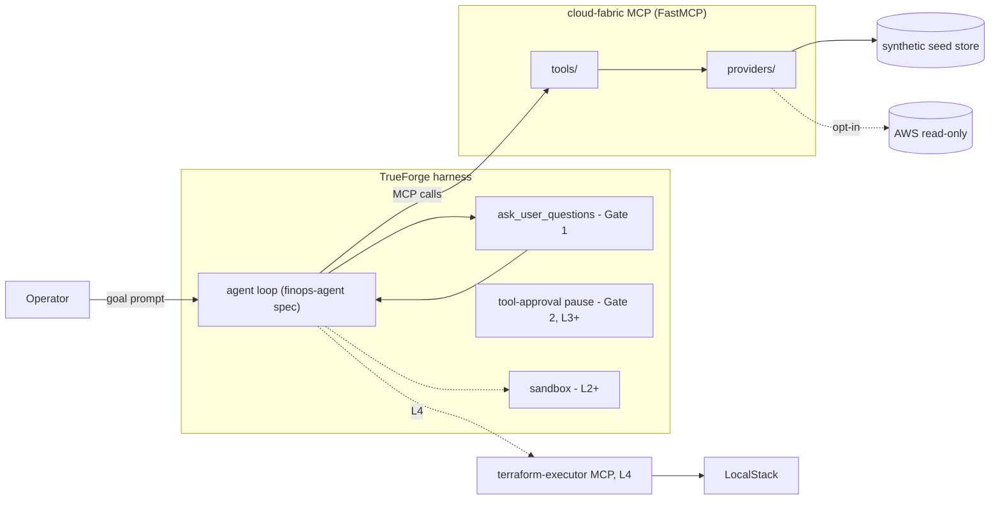

# FLOW — how everything connects

One evolving document. It traces the **current** end-to-end pipeline at the
function level, defines the data contracts that cross component boundaries, and
keeps a per-layer changelog of what each layer added.

**Protocol:** refreshed at every `layer-N` tag; any contract change gets a row
here and, if architectural, an entry in DECISION.md.

---

## 1 · Component map



---

## 2 · Current end-to-end trace (Layer 1)

What happens when an operator types:
> *"Reduce spend by 20% while maintaining 99.9% availability and <200ms p99 latency."*

| # | Stage | Where (file → function) | What happens |
|---|---|---|---|
| 1 | Intake | TrueForge loop | Harness loads agent spec `agents/finops-agent.json` (instructions + connectors + capabilities). |
| 2 | Guardrail parse (Step 0) | agent `instructions` | Model extracts `{savings_target_pct, availability_slo, latency_slo_p99_ms, environment}` and restates them as a guardrail block it must repeat atop every report. |
| 3 | Clarify (Gate 1) | harness capability `ask_user_question` | If environment ambiguous → multiple-choice card ("Prod or Dev?"); answer locks the guardrail block. |
| 4 | Plan turn (Step 1, heuristic in L1) | model output | Short checklist of domains to inspect: compute, storage, k8s, network, billing. |
| 5 | List resources (Step 2) | `mcp/cloud-fabric/src/cloud_fabric/tools/register.py` → `list_resources(cursor, domain)` | MCP tool entry; validates nothing itself, delegates to core. |
| 6 | Page fetch | `tools/core.py` → `list_resources_page()` → `providers/__init__.py` → `normalize_domain()`, `fabric_core/cursor.py` → `decode_cursor()` | Decodes cursor against the filter set; asks provider for one bounded page. |
| 7 | Page data | `providers/synthetic.py` → `SyntheticProvider.page(domain, offset, limit)` | In-memory seeded store slice → `(items, total_estimate)`. |
| 8 | Cursor out | `fabric_core/cursor.py` → `encode_cursor()` | Tool returns `{items, next_cursor, total_estimate, freshness}` via `tools/core.py` → `_envelope()`. |
| 9 | Walk pages | agent loop | Repeats #5–8 while `next_cursor != null` (page size ≤ 1000). |
| 10 | Billing rollup (Step 3 context) | `tools/core.py` → `get_billing_summary_response()` → provider `billing(days)` | Monthly cost per domain/service for the report headline. |
| 11 | Metrics drill-down | `tools/core.py` → `get_metrics_response()` → provider `metrics(arn, days)` | Per-resource daily series when the agent inspects a suspicious candidate. |
| 11 | Report | model + Generative UI | Guardrail block → cost table (Generative UI) → top heuristic waste candidates (CPU-threshold only in L1) → freshness/degraded banner → explicit "read-only analysis" footer. |

**Not yet in this trace** (added later): sandbox detectors (L2), simulation/CVaR/manifest/approval pause (L3), terraform-executor + LocalStack apply/backup/rollback (L4), collector subagents + post-exec watcher (L5).

### Call graph, Layer 1 tools

```
list_resources(cursor?, domain?)                      [tools/register.py, @mcp.tool readOnlyHint]
└── tools/core.py :: list_resources_page()
    ├── providers/__init__.py :: normalize_domain()
    ├── fabric_core.cursor :: decode_cursor(cursor, filters_hash)
    ├── FabricProvider.page(domain, offset, limit) -> (items, total)
    └── fabric_core.cursor :: encode_cursor(next_offset, filters_hash)

get_metrics(resource_arn, window_days)                [tools/register.py]
├── tools/core.py :: get_metrics_response()
└── FabricProvider.metrics(arn, days) -> list[MetricPoint]

get_billing_summary(period_days)                      [tools/register.py]
├── tools/core.py :: get_billing_summary_response()
└── FabricProvider.billing(days) -> list[BillingSummaryItem]

wiring: server.py :: build_server() -> FabricSettings -> providers.get_provider()
        -> FastMCP("cloud-fabric", instructions=...) -> register_tools(mcp, provider, settings)
```

---

## 3 · Data contracts

### ResourceSnapshot (pydantic, `packages/fabric-core/src/fabric_core/models.py`)

| Field | Type | Notes |
|---|---|---|
| `resource_arn` | str | Stable unique id across providers |
| `resource_type` | str | e.g. `ec2_instance`, `ebs_volume`, `ebs_snapshot`, `k8s_pod`, `nat_gateway`, `alb` |
| `domain` | enum | `compute` / `storage` / `k8s` / `network` |
| `region` | str | |
| `instance_family` | str \| None | Compute only (`m5`, `c5`, …) |
| `hourly_cost` | float | USD |
| `avg_cpu` / `avg_memory` | float \| None | Percent, 14d mean where applicable |
| `p99_latency_ms` | float \| None | Edge/request-serving resources |
| `created_at` / `collected_at` | datetime | `collected_at` drives freshness |
| `status` | enum | `ok` / `degraded` (Step 2.5 flag) |
| `parent_arn` / `parent_state` | str \| None | Lineage for zombie detection in L2 |

### Pagination envelope (all listing tools)

```json
{
  "items": [ /* ResourceSnapshot dicts */ ],
  "next_cursor": "eyJvIjo1MDAsImgiOiJhMWIyYzNkNCJ9",
  "total_estimate": 12480,
  "freshness": {"collected_at": "...", "degraded_domains": []}
}
```

Cursor = base64url(JSON `{"o": <offset>, "h": "<sha256(filter)[0:8]>"}`). A
cursor whose hash mismatches the request's filters raises a validation error
(D-006). Max page size 1000, default 500.

### MetricPoint

`{date, avg_cpu, avg_memory, p99_latency_ms, requests_per_sec}` × up to 14 days.

### BillingSummaryItem

`{domain, service, monthly_cost_usd, delta_vs_prev_pct}`.

---

## 4 · Layer changelog

| Layer | Added to this flow |
|---|---|
| 1 (2026-08-25) | Initial trace: intake → guardrails → clarify → paginated fabric reads → normalized report. Contracts: ResourceSnapshot, pagination envelope, MetricPoint, BillingSummaryItem. |
